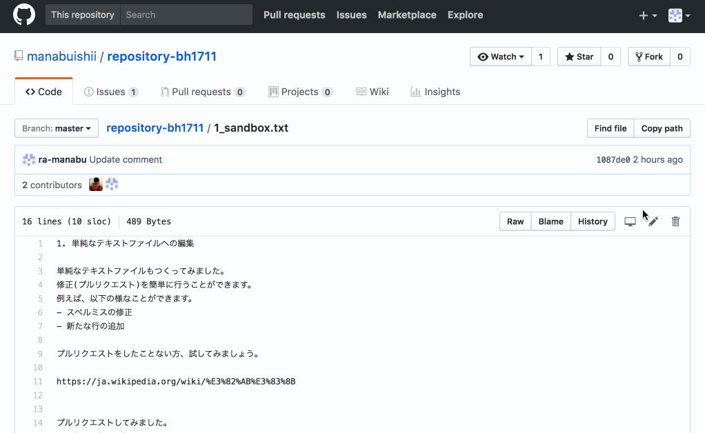

# 国内版バイオハッカソンの GitHub セッション

テスト用に作りました。

Issueの作成 や PullRequest のテストにもどうぞ。

スペルミスや、リンク切れの修正などの簡単な修正であれば、ブラウザだけでもできます。

1. [テキストファイルも修正できます](./1_textfile.txt)
1. [マークダウンへも修正できます](./2_markdown.txt)
1. [プログラムも修正できます](./3_python.py)

# こんなかんじで修正ができます

TODO: やり方を書く予定予定。

# 自分のレポジトリで、プルリクエストを試す方法

なんかできそうなので、やってみる。

# Pull Request のやり方、例

この画像の作成には [Cockos Incorporated \| LICEcap](https://www.cockos.com/licecap/) を使いました
